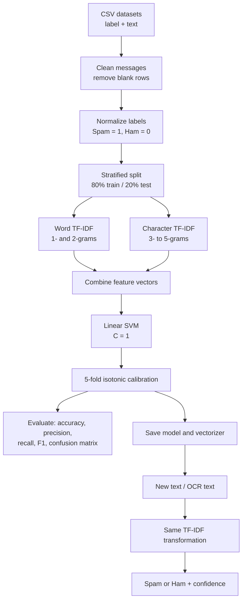

# Social Network Spam Detection System

A full-stack web application for identifying spam in social-network posts,
comments, and uploaded content. Users can register with email verification,
classify text, text files, or images, save posts, view prediction history, and
review activity analytics. An administrator view supports managing users,
posts, and reviews.

The classifier uses TF-IDF word and character features with a calibrated
Linear Support Vector Machine (SVM). It returns either **Spam** or **Ham**
(legitimate content), together with a confidence score.

> This is a detection aid, not a guarantee that content is safe. Review
> important moderation, financial, or security decisions manually.

## Contents

- [Features](#features)
- [Technology](#technology)
- [Methodology](#methodology)
- [Project structure](#project-structure)
- [Requirements](#requirements)
- [Run locally](#run-locally)
- [Using the application](#using-the-application)
- [API reference](#api-reference)
- [Training the model](#training-the-model)
- [Data and storage](#data-and-storage)
- [Deploy to Render and Vercel](#deploy-to-render-and-vercel)
- [Security notes](#security-notes)
- [Troubleshooting](#troubleshooting)

## Features

- Email OTP verification during user registration
- User login, dashboard, profile editing, and prediction history
- Spam classification for typed social-media text
- Batch classification of UTF-8 `.txt` files, one message per line or
  paragraph
- Image classification for PNG, JPG, and WEBP files using Tesseract OCR
- Image safeguard for clearly institutional posters when multiple official
  context signals are found and scam wording is absent
- Post creation with automatic spam classification and city-based trending
  view
- User and administrator analytics for spam, ham, posts, and users
- Reviews submitted by users and managed through the administrator view
- Docker configuration for deploying the FastAPI service

## Technology

| Area | Tools |
| --- | --- |
| Frontend | React 19, Vite, React Router, Tailwind CSS, Axios, Chart.js |
| Backend | Python, FastAPI, Uvicorn, Pydantic |
| Machine learning | scikit-learn, TF-IDF, LinearSVC, CalibratedClassifierCV, joblib |
| Image processing | Pillow, pytesseract, Tesseract OCR |
| Database | SQLite |
| Email | Gmail SMTP with a Gmail App Password |
| Deployment | Docker, Render, Vercel |

## Methodology

The system treats spam detection as a supervised binary text-classification
problem. Each labelled message is represented as a numerical feature vector,
then classified as **Spam** (`1`) or **Ham** (`0`).

### Dataset preparation

The training script reads one or more CSV files from `dataset/`. It accepts
the following columns so datasets from different sources can be combined:

| Item | Accepted values / columns |
| --- | --- |
| Text column | `text`, `message`, `content`, `comment`, `tweet`, `post`, or `v2` |
| Label column | `label`, `class`, `v1`, `category`, or `target` |
| Spam labels | `spam`, `1`, `true`, `yes` |
| Ham labels | `ham`, `not_spam`, `legitimate`, `normal`, `0`, `false`, `no` |

For every CSV row, the script removes missing or blank messages, trims text,
normalizes the label to lowercase, and converts it to a binary target:

\[
y_i = \begin{cases}
1, & \text{if message } i \text{ is spam} \\
0, & \text{if message } i \text{ is ham}
\end{cases}
\]

The cleaned data is divided into 80% training data and 20% test data. The
split is stratified, meaning the spam/ham proportion is kept similar in both
sets; `random_state=42` makes the split reproducible.

### Training and prediction flow



### Step-by-step model process

1. **Collect labelled messages.** The datasets contain examples of legitimate
   posts/messages (Ham) and unwanted or deceptive messages (Spam).
2. **Clean and validate.** Empty text is removed. Only supported labels are
   accepted, preventing unknown classes from entering training.
3. **Create word features.** A TF-IDF vectorizer learns English word unigrams
   and bigrams, such as `claim`, `free prize`, or `meeting tomorrow`.
4. **Create character features.** A second TF-IDF vectorizer learns character
   3- to 5-grams inside word boundaries. This helps recognize spelling
   variations and obfuscation such as `fr33`, `cl!ck`, or unusual URLs.
5. **Combine features.** The word and character vectors are joined into one
   sparse feature vector for each message.
6. **Train the Linear SVM.** It learns a separating boundary between Spam and
   Ham from the combined vectors.
7. **Calibrate probabilities.** Five-fold isotonic calibration converts the
   SVM decision values into estimated probabilities for the confidence score.
8. **Evaluate.** The held-out 20% test set is used to calculate accuracy,
   precision, recall, F1 score, and a confusion matrix.
9. **Predict new content.** The saved vectorizer converts new typed text,
   text-file lines, or OCR-extracted image text using the same learned
   vocabulary; the saved classifier then returns the label and confidence.

### Equations used for spam detection

For a term or n-gram \(t\) in message \(d\), the TF-IDF feature value is:

\[
\operatorname{tfidf}(t,d) = \operatorname{tf}(t,d) \times
\log\left(\frac{N + 1}{\operatorname{df}(t) + 1}\right)
\]

where \(\operatorname{tf}(t,d)\) is the term frequency, \(N\) is the number
of training messages, and \(\operatorname{df}(t)\) is the number of training
messages containing \(t\). This project enables sublinear term frequency, so
repeated terms are scaled as:

\[
\operatorname{tf}(t,d) =
\begin{cases}
1 + \log(c_{t,d}), & c_{t,d} > 0 \\
0, & c_{t,d} = 0
\end{cases}
\]

The final message vector is the concatenation of word and character features:

\[
\mathbf{x}_d = [\mathbf{x}_{\text{word}} \; ; \; \mathbf{x}_{\text{char}}]
\]

The Linear SVM produces a decision score:

\[
f(\mathbf{x}_d) = \mathbf{w}^{T}\mathbf{x}_d + b
\]

During training, it finds \(\mathbf{w}\) and \(b\) by minimizing hinge loss
with L2 regularization:

\[
\min_{\mathbf{w},b}\; \frac{1}{2}\lVert\mathbf{w}\rVert^2 +
C\sum_{i=1}^{n}\max\left(0, 1 - y_i f(\mathbf{x}_i)\right)
\]

with \(C=1\) in this project (for the SVM objective, class labels are treated
as \(-1\) for Ham and \(+1\) for Spam). Isotonic calibration learns a
monotonic mapping \(g\) from decision scores to a probability:

\[
P(\text{Spam}\mid\mathbf{x}_d) = g(f(\mathbf{x}_d))
\]

The displayed confidence is:

\[
\operatorname{confidence} = 100 \times
\max\big(P(\text{Spam}\mid\mathbf{x}_d), P(\text{Ham}\mid\mathbf{x}_d)\big)
\]

The predicted class is Spam when the calibrated spam probability is at least
0.5; otherwise it is Ham.

## Project structure

```text
SpamDetectionProject/
├── backend/
│   ├── app.py                 # FastAPI routes and prediction logic
│   ├── database.py            # SQLite tables and queries
│   ├── train_model.py         # Model training script
│   ├── requirements.txt       # Python dependencies
│   └── .env.example           # Backend environment-variable template
├── frontend/
│   ├── src/pages/             # Login, dashboard, detection, admin, and other views
│   ├── src/components/        # Navigation and route-protection components
│   ├── src/config/api.js      # Frontend API base URL configuration
│   ├── .env.example           # Frontend environment-variable template
│   └── package.json           # Node scripts and dependencies
├── dataset/                   # Baseline and social-network CSV datasets
├── model/                     # Saved model and vectorizer files
├── Dockerfile                 # Backend container image
├── render.yaml                # Render Blueprint definition
├── DATASET.md                 # Dataset format and training details
└── DEPLOYMENT.md              # Concise deployment guide
```

## Requirements

- Python 3.11 or later
- Node.js 20 or later and npm
- Tesseract OCR for image prediction
- A Gmail account with an App Password if email OTP delivery is required

Install Tesseract locally before starting the backend:

```bash
# macOS (Homebrew)
brew install tesseract

# Ubuntu/Debian
sudo apt-get install tesseract-ocr
```

Image analysis is optional. Text and text-file predictions work without
Tesseract, but `/predict-image` will return a configuration error.

## Run locally

### 1. Clone and enter the project

```bash
git clone <your-repository-url>
cd SpamDetectionProject
```

### 2. Set up the backend

Create and activate a virtual environment:

```bash
cd backend
python3 -m venv .venv
source .venv/bin/activate
```

On Windows PowerShell, activate it with:

```powershell
.venv\Scripts\Activate.ps1
```

Install dependencies and create the environment file:

```bash
pip install -r requirements.txt
cp .env.example .env
```

Edit `backend/.env` and supply Gmail credentials if you want real OTP email:

```dotenv
GMAIL_EMAIL=your-gmail-address@example.com
GMAIL_PASSWORD=your-16-character-gmail-app-password

# Optional local settings
ALLOWED_ORIGINS=http://localhost:5173,http://127.0.0.1:5173
# DATABASE_PATH=/absolute/path/to/spam_detection.db
```

`GMAIL_PASSWORD` must be a Gmail **App Password**, not the normal Google
account password. If these variables are absent, the backend logs the demo OTP
to its console instead of sending an email.

Start the API:

```bash
uvicorn app:app --reload --host 0.0.0.0 --port 8000
```

The API is available at `http://localhost:8000`; interactive FastAPI docs are
available at `http://localhost:8000/docs`.

### 3. Set up the frontend

Open another terminal in the project root:

```bash
cd frontend
npm install
cp .env.example .env
```

For the local backend, leave `VITE_API_URL` unset or set it explicitly:

```dotenv
VITE_API_URL=http://localhost:8000
```

Start the frontend:

```bash
npm run dev
```

Open the URL printed by Vite, normally `http://localhost:5173`.

### 4. Verify the installation

Run these checks from separate terminals:

```bash
curl http://localhost:8000/
curl -X POST http://localhost:8000/predict \
  -H 'Content-Type: application/json' \
  -d '{"text":"You have won a free prize. Claim now!"}'
```

Build the frontend for a production check:

```bash
cd frontend
npm run build
```

## Using the application

1. Register an account. Request an OTP, enter the code received by email, and
   complete registration.
2. Sign in and use **Detect Spam** to submit text, a `.txt` file, or an image.
3. Create a post from **Post Tweet**. The API classifies it before saving it.
4. Review saved results in **History**, activity counts in **Analytics**, and
   city activity in **Trending**.
5. Use **Reviews** to submit or read feedback.

The backend also creates a local demonstration user at startup:

```text
Username: demo_user
Password: demo123
```

Only use this account for local demonstration. It is not suitable for a public
deployment.

## API reference

All JSON requests use `Content-Type: application/json`. File endpoints use
`multipart/form-data`. Visit `/docs` on a running backend for interactive
schemas and testing.

| Method | Endpoint | Purpose |
| --- | --- | --- |
| `GET` | `/` | Health response |
| `POST` | `/send-otp` | Generate and send a six-digit email OTP |
| `POST` | `/verify-otp` | Verify an email OTP |
| `POST` | `/register` | Create a verified user account |
| `POST` | `/login` | Authenticate a user |
| `POST` | `/predict` | Classify one text message; optionally save it to history with `user_id` |
| `GET` | `/prediction-history?user_id={id}` | Return the user’s latest prediction history |
| `POST` | `/predict-file` | Classify all non-empty messages in a UTF-8 text file |
| `POST` | `/predict-image` | OCR and classify a PNG, JPG, or WEBP image (10 MB maximum) |
| `POST` | `/post-tweet` | Classify and save a user post |
| `GET` | `/tweets?user_id={id}` | Return posts; omit `user_id` for all posts |
| `DELETE` | `/tweets/{tweet_id}` | Delete a post; use optional `user_id` to restrict deletion to its owner |
| `GET` | `/dashboard?user_id={id}` | Return dashboard totals |
| `GET` | `/analytics?user_id={id}` | Return spam/ham analytics |
| `PUT` | `/profile` | Update a user profile |
| `GET` / `DELETE` | `/users`, `/users/{user_id}` | List or delete users |
| `GET` / `POST` | `/reviews` | List or add reviews |
| `DELETE` | `/reviews/{review_id}` | Delete a review |

Example prediction request:

```json
POST /predict
{
  "text": "Congratulations! Click this link to claim your cash prize.",
  "user_id": 1
}
```

Example response:

```json
{
  "prediction": "Spam",
  "confidence": 98.42
}
```

## Training the model

The included training script accepts one or more CSV files, or a directory of
CSV files. Each data source must contain one supported label column and one
supported text column.

| Required value | Accepted columns |
| --- | --- |
| Label | `label`, `class`, `v1`, `category`, `target` |
| Text | `text`, `message`, `content`, `comment`, `tweet`, `post`, `v2` |

Supported labels are `spam`, `1`, `true`, and `yes` for spam; `ham`,
`not_spam`, `not spam`, `legitimate`, `normal`, `0`, `false`, and `no` for
legitimate content.

The recommended CSV format is:

```csv
label,text
ham,The registration deadline is Friday at 5 PM.
spam,Click here now to receive your guaranteed cash reward.
```

Train with a social-network dataset:

```bash
cd backend
python train_model.py --dataset ../dataset/social_network_dataset_format.csv
```

Train with multiple datasets and save their normalized combination:

```bash
python train_model.py \
  --dataset ../dataset/social_network_dataset_format.csv ../dataset/spam.csv \
  --export-dataset ../dataset/combined_social_network_spam.csv
```

The script uses an 80/20 stratified train-test split and prints accuracy,
precision, recall, F1 score, a confusion matrix, and a classification report.
It writes the updated artefacts to:

```text
model/spam_model.pkl
model/vectorizer.pkl
```

Restart the backend after retraining. See [DATASET.md](DATASET.md) for the
social-network dataset guidance.

## Data and storage

SQLite initializes automatically when the backend starts. It contains these
tables:

| Table | Description |
| --- | --- |
| `users` | Registered user profiles and login records |
| `tweets` | Saved posts with city, classification, confidence, and owner |
| `prediction_history` | Predictions made through the single-text endpoint |
| `reviews` | User feedback and ratings |

By default the local database is `backend/spam_detection.db`. Set
`DATABASE_PATH` to keep it elsewhere. The database file is application data;
do not commit a production copy to version control.

## Deploy to Render and Vercel

The repository includes a Dockerfile and `render.yaml` Blueprint for the API.
The frontend can be deployed independently to Vercel.

### 1. Prepare the repository

1. Commit the application source, model files, `Dockerfile`, and `render.yaml`
   to a Git repository.
2. Do **not** commit real `.env` files, Gmail App Passwords, or production
   database files.
3. If any credential has previously been committed, revoke and replace it
   before deployment.

### 2. Deploy the backend to Render

1. Sign in to Render and connect the Git repository.
2. Select **New → Blueprint** and choose the repository and target branch.
3. Render reads `render.yaml`, builds the root Dockerfile, installs Tesseract,
   and exposes the FastAPI service.
4. Set these Render environment variables:

   | Variable | Value |
   | --- | --- |
   | `GMAIL_EMAIL` | Gmail address used to send verification codes |
   | `GMAIL_PASSWORD` | Newly generated Gmail App Password |
   | `ALLOWED_ORIGINS` | Your Vercel URL, e.g. `https://your-app.vercel.app` |
   | `DATABASE_PATH` | Already set by the Blueprint to `/tmp/spam_detection.db` |

5. Deploy and copy the generated backend URL, such as
   `https://spam-detection-api.onrender.com`.
6. Open `https://<your-render-url>/docs` to confirm the API starts.

### 3. Deploy the frontend to Vercel

1. Import the same Git repository in Vercel.
2. Set **Root Directory** to `frontend`.
3. Add the environment variable below, using the Render URL without a trailing
   slash:

   ```dotenv
   VITE_API_URL=https://spam-detection-api.onrender.com
   ```

4. Deploy the project.
5. Copy the Vercel production URL into Render’s `ALLOWED_ORIGINS` setting, then
   redeploy the Render service if you changed that setting.

Vite embeds `VITE_API_URL` at build time. Redeploy Vercel whenever the value
changes.

### Deployment limitation

The configured Render free web-service tier has an ephemeral filesystem. Its
SQLite database at `/tmp/spam_detection.db` is reset after a restart or
redeploy. Use a managed database and update `database.py` before relying on the
application for persistent production data.

## Security notes

This project is appropriate for learning and demonstration, but harden it
before public use:

- Passwords are currently stored as plain text. Use a password hashing library
  such as Argon2 or bcrypt.
- The current user and administrator flows do not use server-issued sessions,
  JWTs, or role-based authorization. Add authenticated server-side access
  control before exposing management endpoints.
- Never expose, commit, or reuse Gmail App Passwords.
- Restrict `ALLOWED_ORIGINS` to your known frontend domains in production.
- Validate uploaded content and apply rate limits, logging, HTTPS, and security
  monitoring for a real deployment.
- Replace SQLite with managed persistent storage for production.

## Troubleshooting

| Problem | Resolution |
| --- | --- |
| Frontend cannot reach the backend | Verify `VITE_API_URL`, start the API on port 8000, and include the frontend URL in `ALLOWED_ORIGINS`. |
| OTP does not arrive | Confirm the Gmail address and App Password. Check backend logs; absent credentials intentionally use a console fallback. |
| Image prediction reports OCR unavailable | Install Tesseract locally and restart the backend. The Docker image installs it automatically. |
| Image has no readable text | Use a sharper, well-lit image with larger text, or submit the text manually. |
| Model changes are not visible | Restart the backend after running `train_model.py`. |
| Data disappears after a Render deploy | Expected on Render’s free tier with SQLite in `/tmp`; use persistent managed storage. |

For a shorter deployment checklist, see [DEPLOYMENT.md](DEPLOYMENT.md).
